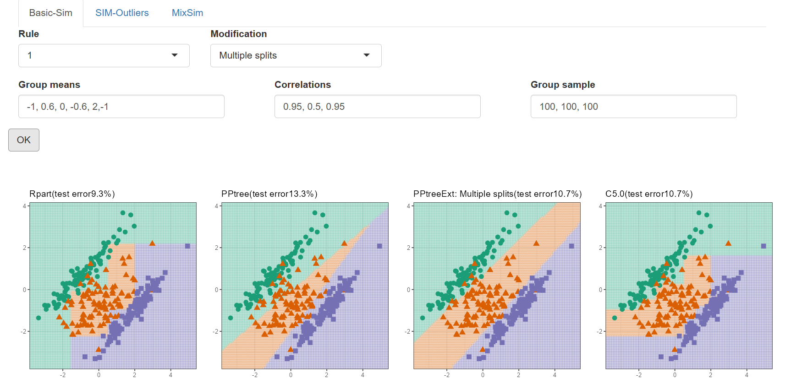
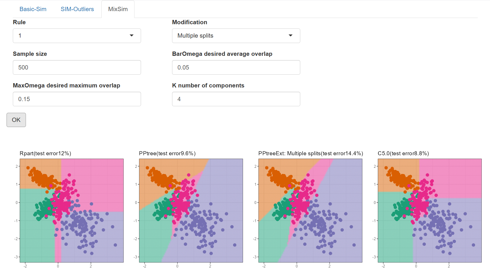
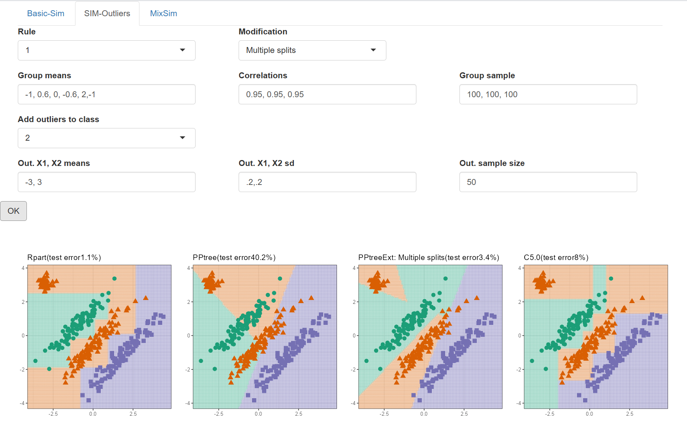

# Easy Test: C5.0 Classifier Integration
PR Link: https://github.com/natydasilva/classbound/pull/3

## Overview

This project completes the **"Easy"** GSoC Evaluation task for the `classbound` package by integrating the **C5.0** classification method into the existing `explorapp()` Shiny application.

The motivation for this feature is to allow users to compare the decision boundaries of C5.0 (a modern, efficient decision tree algorithm) side-by-side with the existing methods (`rpart`, `PPtree`, and `PPtreeExt`) across different simulated datasets in 2D scatter plots.

## Implementation Details

The integration involved several coordinated changes across the package:

1. **Dependency Addition:** Added the `C50` package to the `Imports` field in the `DESCRIPTION` file to ensure the dependency is properly managed when the package is installed.
2. **`ppbound()` Function Update:** 
   - Extended the core boundary plotting function in `R/app.R` to accept `"C50"` as a valid `meth` argument.
   - Added logic to fit a `C5.0(Sim ~ ., data = data)` model.
   - Implemented prediction handling (`predict(object = c50tree, newdata = grilla)`) to calculate the continuous 2D boundary grid and the test error.
3. **Shiny UI Updates:**
   - Modified the UI logic for all three simulation tabs (`Basic-Sim`, `SIM-Outliers`, and `MixSim`).
   - Updated the `gridExtra::grid.arrange()` calls to render 4 columns (`ncol = 4`) instead of 3, cleanly placing the new C5.0 boundary plot alongside the original three.
4. **Documentation:** Updated the roxygen block for `explorapp()` to reflect the addition of C5.0 boundaries.

## Results & Visual Proof

By running the updated app (`devtools::load_all(); explorapp()`), the C5.0 classifier visually appears as the fourth panel in every scenario.

The following screenshots demonstrate successful integration across all three distinct simulation tools in the app:

### 1. Basic-Sim

_Shows C5.0 smoothly classifying the standard simulated Gaussian classes alongside rpart and PPtree._

### 2. MixSim

_Demonstrates C5.0's behavior on the more complex Maitra mixture simulation data._

### 3. SIM-Outliers

_Highlights how C5.0's decision boundaries react when explicit outliers are introduced into the dataset compared to the projection pursuit methods._

## Setup & Testing
1. Install requirements: `install.packages(c("C50", "gridExtra", "ggplot2", "shiny"))`
2. Load the package: `devtools::load_all()`
3. Launch the app: `explorapp()`
4. Generate data via any of the tabs (Basic-Sim, SIM-Outliers, or MixSim) and observe the 4-panel boundary comparison.
