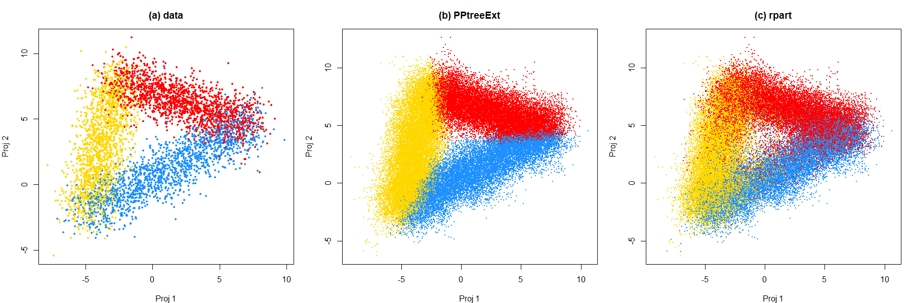

# Medium Test: Grand Tour Boundary Comparison

## Overview

This test compares the decision boundaries of **rpart** (CART) and **PPtreeExt** classifiers on the `data69-1` (waveform) dataset using tour-based visualization methods from the `tourr` package.

The goal is to reproduce **Figure 11** from the paper [*An Enhanced Projection Pursuit Tree Classifier with Visual Methods for Assessing Algorithmic Improvements*](https://arxiv.org/abs/2602.21130), which demonstrates that PPtreeExt produces cleaner oblique boundaries compared to rpart's boxy axis-aligned splits.

Reference: [Chapter 15 - Trees and Forests](https://dicook.github.io/mulgar_book/15-forests.html) from *Interactively Exploring High-Dimensional Data and Models in R*.

## Dataset

- **data69-1** (waveform database generator): 5,000 observations, 21 numerical features, 3 classes
- Source: [UCI Machine Learning Repository](https://archive.ics.uci.edu/dataset/107/waveform+database+generator+version+1)
- Available in the `classbound` package as `data69_1`

## Method

### 1. Model Fitting
Two classification models are fitted on the full 21-dimensional data:
- **rpart**: CART decision tree - makes axis-aligned splits
- **PPtreeExt**: Enhanced projection pursuit tree - makes oblique splits using linear combinations of variables

### 2. Guided Tour (LDA Index)
A **guided tour** with the LDA projection pursuit index is used to find the best 2D projection that separates the 3 classes. This optimal projection is then reused for all subsequent visualizations to ensure fair comparison.

### 3. Boundary Point Generation
50,000 points are generated by **resampling real data points with Gaussian noise** (30% of each variable's standard deviation). This ensures generated points stay near the data manifold where classifier boundaries actually differ - uniform random sampling in 21D would place most points in empty space where both classifiers trivially agree.

### 4. Slice Tour Visualization
A **slice tour** is applied to the predicted boundary points for each model, using the same projection path from the guided tour. The slice tour cuts through the center of the 21D space, revealing the boundary structure in 2D projections.

## Results

### Static Comparison



| Panel | Description |
|-------|-------------|
| **(a) data** | Original data projected via guided tour (LDA index). The 3 classes form a triangular arrangement. |
| **(b) PPtreeExt** | Boundary regions from PPtreeExt. Classes are cleanly separated with **smooth oblique cuts** that follow the natural class shapes. |
| **(c) rpart** | Boundary regions from rpart. Classes show **messier, more mixed boundaries** due to axis-aligned splits that cannot capture the oblique separations in this data. |

### Animated GIFs (Slice Tour)

| File | Description |
|------|-------------|
| `gifs/data69_1_guided_tour.gif` | Guided tour of the raw data showing 3-class separation |
| `gifs/data69_1_ppext_boundaries.gif` | Slice tour of PPtreeExt predicted boundaries |
| `gifs/data69_1_rpart_boundaries.gif` | Slice tour of rpart predicted boundaries |

## Key Findings

- **PPtreeExt** produces clean, oblique decision boundaries that respect the natural geometry of the class clusters
- **rpart** produces boxy, axis-aligned boundaries that are visibly messier - the data requires oblique cuts which rpart cannot provide
- This confirms the paper's finding: PPtreeExt outperforms rpart on data where the best separation between groups is in oblique directions

## How to Run

### Prerequisites
```r
install.packages(c("tourr", "rpart", "PPtreeExt", "gifski"))
# classbound must be installed from GitHub:
# remotes::install_github("natydasilva/classbound")
```

### Execution
```r
setwd("path/to/classbound/med")
source("medium_test_tour.R")
```

This will:
1. Fit both models on `data69_1`
2. Run a guided tour to find the optimal LDA projection
3. Generate 50K boundary points and predict with both models
4. Save 3 animated GIFs to `gifs/`
5. Display a static 3-panel comparison plot

### File Structure
```
med/
├── README.md                  # This file
├── medium_test_tour.R         # Main analysis script
├── gifs/
│   ├── data69_1_guided_tour.gif
│   ├── data69_1_ppext_boundaries.gif
│   └── data69_1_rpart_boundaries.gif
└── images/
    └── data69_1_boundary_comparison.png
```
